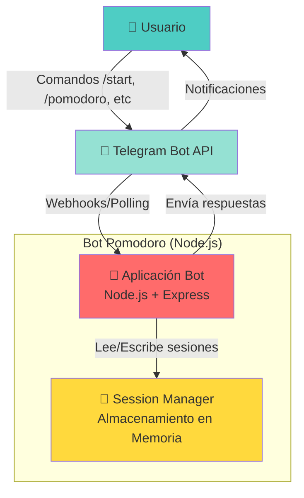

# C2 - Diagrama de Contenedores

```mermaid
graph TB
    Usuario[👤 Usuario]
    
    subgraph "Bot Pomodoro (Node.js)"
        BotApp[🤖 Aplicación Bot<br/>Node.js + Express]
        SessionMgr[💾 Session Manager<br/>Almacenamiento en Memoria]
    end
    
    TelegramAPI[📱 Telegram Bot API]
    
    Usuario -->|Comandos /start, /pomodoro, etc| TelegramAPI
    TelegramAPI -->|Webhooks/Polling| BotApp
    BotApp -->|Lee/Escribe sesiones| SessionMgr
    BotApp -->|Envía respuestas| TelegramAPI
    TelegramAPI -->|Notificaciones| Usuario
    
    style BotApp fill:#ff6b6b
    style SessionMgr fill:#ffd93d
    style Usuario fill:#4ecdc4
    style TelegramAPI fill:#95e1d3
```