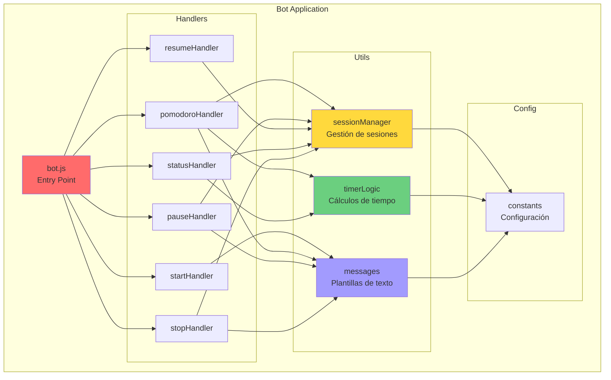

# C3 - Diagrama de Componentes

```mermaid
graph TB
    subgraph "Bot Application"
        Bot[bot.js<br/>Entry Point]
        
        subgraph "Handlers"
            StartH[startHandler]
            PomodoroH[pomodoroHandler]
            PauseH[pauseHandler]
            ResumeH[resumeHandler]
            StatusH[statusHandler]
            StopH[stopHandler]
        end
        
        subgraph "Utils"
            SessionM[sessionManager<br/>Gestión de sesiones]
            TimerL[timerLogic<br/>Cálculos de tiempo]
            Messages[messages<br/>Plantillas de texto]
        end
        
        subgraph "Config"
            Constants[constants<br/>Configuración]
        end
    end
    
    Bot --> StartH
    Bot --> PomodoroH
    Bot --> PauseH
    Bot --> ResumeH
    Bot --> StatusH
    Bot --> StopH
    
    PomodoroH --> SessionM
    PauseH --> SessionM
    ResumeH --> SessionM
    StatusH --> SessionM
    StopH --> SessionM
    
    PomodoroH --> TimerL
    StatusH --> TimerL
    
    StartH --> Messages
    PomodoroH --> Messages
    PauseH --> Messages
    StopH --> Messages
    
    SessionM --> Constants
    TimerL --> Constants
    Messages --> Constants
    
    style Bot fill:#ff6b6b
    style SessionM fill:#ffd93d
    style TimerL fill:#6bcf7f
    style Messages fill:#a29bfe
```