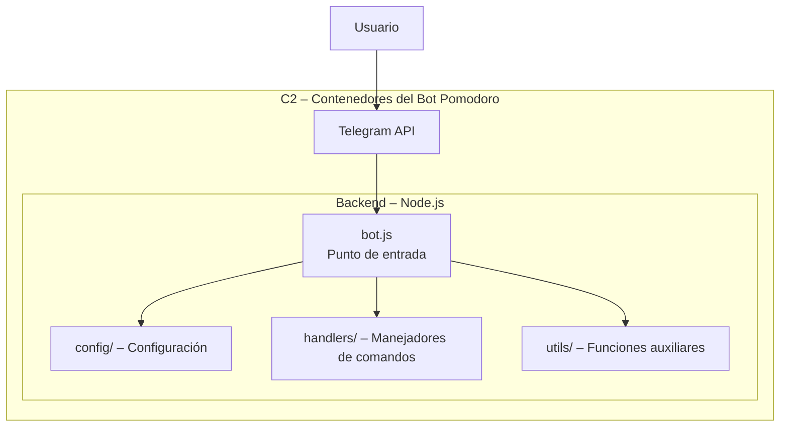

# Diagramas C4 – Bot de Telegram Pomodoro

Los siguientes diagramas representan el modelo C4 del sistema, usando Mermaid para que puedan visualizarse directamente en GitHub.

---

## C1 – Diagrama de Contexto

```mermaid
flowchart TB

subgraph C1[ C1 – Contexto del Sistema ]
    U[Usuario de Telegram]
    TG[Telegram API]
    BOT[Bot Pomodoro<br>(Sistema en Node.js)]

    U -->|Envia comandos:<br>/start /pomodoro /pause /resume /status /stop| TG
    TG -->|Reenvía mensaje| BOT
    BOT -->|Responde mensajes| TG
end
```

---

## C2 – Diagrama de Contenedores


