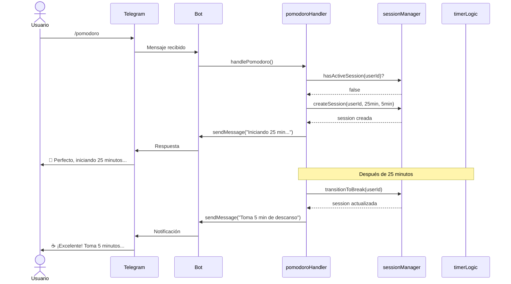

# Diagrama de Secuencia - Comando /pomodoro

```mermaid
sequenceDiagram
    actor Usuario
    participant Telegram
    participant Bot
    participant Handler as pomodoroHandler
    participant SessionMgr as sessionManager
    participant Timer as timerLogic
    
    Usuario->>Telegram: /pomodoro
    Telegram->>Bot: Mensaje recibido
    Bot->>Handler: handlePomodoro()
    Handler->>SessionMgr: hasActiveSession(userId)?
    SessionMgr-->>Handler: false
    Handler->>SessionMgr: createSession(userId, 25min, 5min)
    SessionMgr-->>Handler: session creada
    Handler->>Bot: sendMessage("Iniciando 25 min...")
    Bot->>Telegram: Respuesta
    Telegram->>Usuario: 🍅 Perfecto, iniciando 25 minutos...
    
    Note over Handler,Timer: Después de 25 minutos
    
    Handler->>SessionMgr: transitionToBreak(userId)
    SessionMgr-->>Handler: session actualizada
    Handler->>Bot: sendMessage("Toma 5 min de descanso")
    Bot->>Telegram: Notificación
    Telegram->>Usuario: ☕ ¡Excelente! Toma 5 minutos...
```