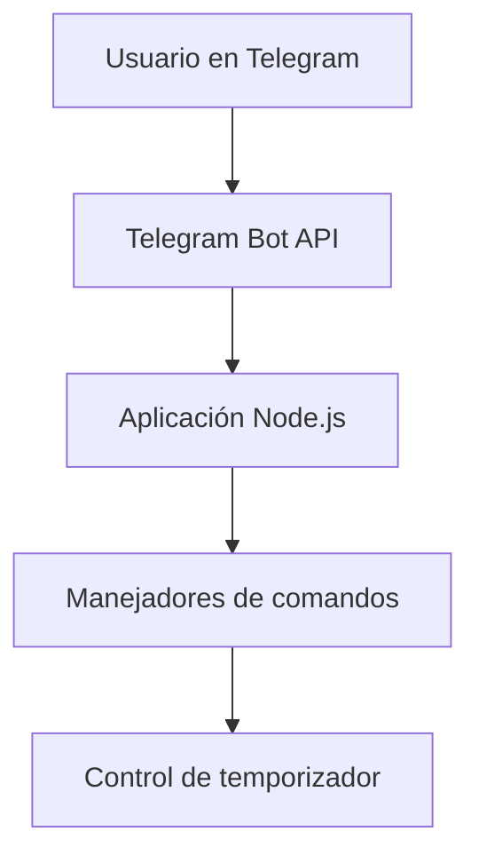
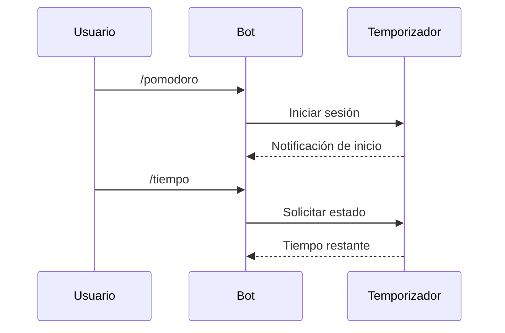

---

# Pomodoro Telegram Bot

Aplicación diseñada para gestionar sesiones de trabajo mediante la técnica Pomodoro utilizando la API de Telegram. El proyecto permite iniciar, pausar, continuar y detener ciclos de trabajo y descanso, proporcionando una herramienta sencilla para mejorar la concentración y la productividad.

## Características principales

* Implementación de la técnica Pomodoro clásica (25 minutos de trabajo y 5 minutos de descanso).
* Control de sesiones a través de comandos en Telegram.
* Sistema de temporizador administrado desde Node.js.
* Arquitectura modular basada en controladores, utilidades y manejo de configuración.
* Diagramas de arquitectura y flujo disponibles en la carpeta correspondiente.

## Arquitectura del proyecto

Los diagramas del sistema se encuentran en `docs/diagrams/`. Incluyen representaciones de arquitectura general, estructura interna y flujo de operaciones del bot.
Cada diagrama está escrito en formato Mermaid e incrustado en los archivos de documentación.

## Requisitos previos

* Node.js 18 o superior
* Cuenta de Telegram
* Un bot creado mediante **@BotFather**
* Token de acceso generado por Telegram
* Git (opcional pero recomendado para clonar el repositorio)

## Instalación

Ejecute los siguientes pasos en un entorno Windows PowerShell:

1. Clonar el repositorio:

   ```powershell
   git clone https://github.com/CarlosCervantes-pi/pomodoro-telegram-bot
   ```
2. Acceder a la carpeta del proyecto:

   ```powershell
   cd pomodoro-telegram-bot
   ```
3. Instalar dependencias:

   ```powershell
   npm install
   ```

## Configuración

El archivo `.env` no se encuentra en el repositorio por motivos de seguridad.
Debe crearse manualmente un archivo `.env` siguiendo el ejemplo proporcionado en `.env.example`.

Contenido esperado en `.env`:

```
TELEGRAM_BOT_TOKEN=tu_token_aquí
```

Este token es obligatorio para establecer comunicación con la API de Telegram.

## Uso del bot

Una vez configurado el entorno, el bot puede ejecutarse mediante:

```powershell
npm run dev
```

Comandos disponibles desde Telegram:

* `/start`
  Presenta el mensaje de bienvenida e instrucciones básicas.

* `/pomodoro`
  Inicia una sesión completa con tiempos de trabajo y descanso.

* `/tiempo`
  Reporta el tiempo restante del ciclo actual.

* `/pausar`
  Suspende temporalmente la sesión.

* `/continuar`
  Reanuda una sesión pausada.

* `/detener`
  Detiene la sesión activa, con confirmación para evitar interrupciones accidentales.

* `/ayuda`
  Muestra la lista de comandos con una breve descripción.

## Estructura del proyecto

```
pomodoro-telegram-bot/
│
├── src/
│   ├── handlers/      # Controladores de comandos y sesiones
│   ├── utils/         # Temporizador, formateo y funciones auxiliares
│   ├── config/        # Manejo de variables de entorno
│   └── index.js       # Punto de entrada de la aplicación
│
├── docs/
│   └── diagrams/      # Diagramas en formato Mermaid
│
├── .gitignore         # Exclusión de archivos sensibles o innecesarios
├── .env.example       # Plantilla para variables de entorno
├── package.json
└── README.md
```

## Diagramas (Mermaid)

Los siguientes diagramas utilizan la sintaxis compatible con GitHub para permitir su representación visual:

### Arquitectura general



### Flujo de una sesión Pomodoro



## Pruebas y solución de problemas

* Verifique que el archivo `.env` exista y contenga un token válido.
* Asegúrese de estar utilizando Node.js 18 o superior.
* Si el bot no responde, valide que el proceso se encuentre en ejecución sin errores en la consola.
* Compruebe que no existan procesos previos en ejecución que utilicen el mismo bot token.

## Plan de mejoras futuras

* Panel web para visualizar estadísticas de uso.
* Configuración personalizable de tiempos de trabajo y descanso.
* Persistencia de sesiones y métricas.
* Integración con bases de datos para análisis de productividad.

## Contribución

Las contribuciones son bienvenidas.
Para colaborar:

1. Crear una rama descriptiva.
2. Implementar cambios.
3. Enviar un pull request con una explicación clara.

## Licencia

Este proyecto se distribuye bajo la licencia MIT.

## Autor

Desarrollado por Carlos Cervantes.
Puede encontrar el repositorio en:
[https://github.com/CarlosCervantes-pi/pomodoro-telegram-bot](https://github.com/CarlosCervantes-pi/pomodoro-telegram-bot)

---
